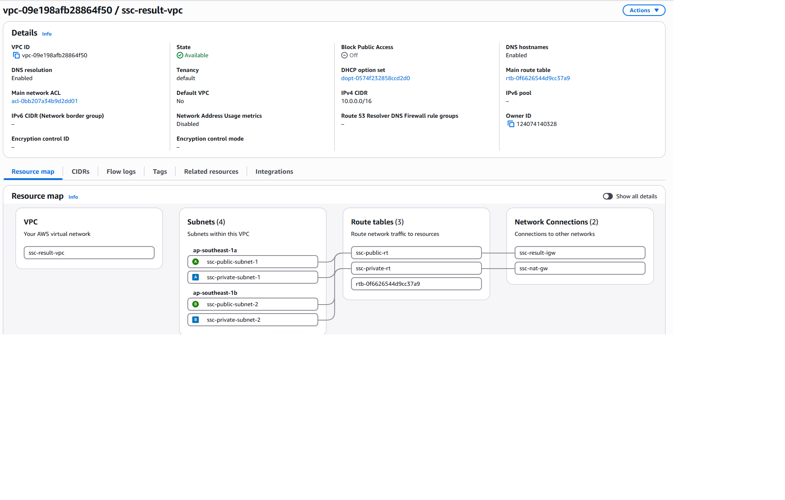
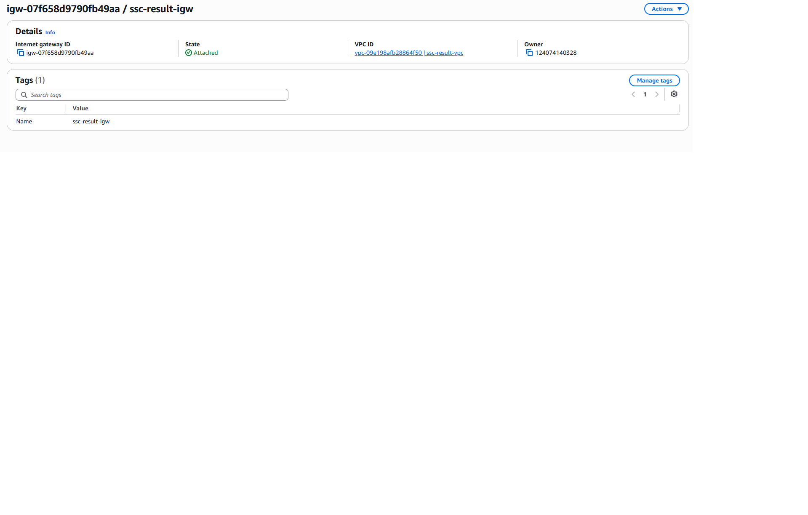
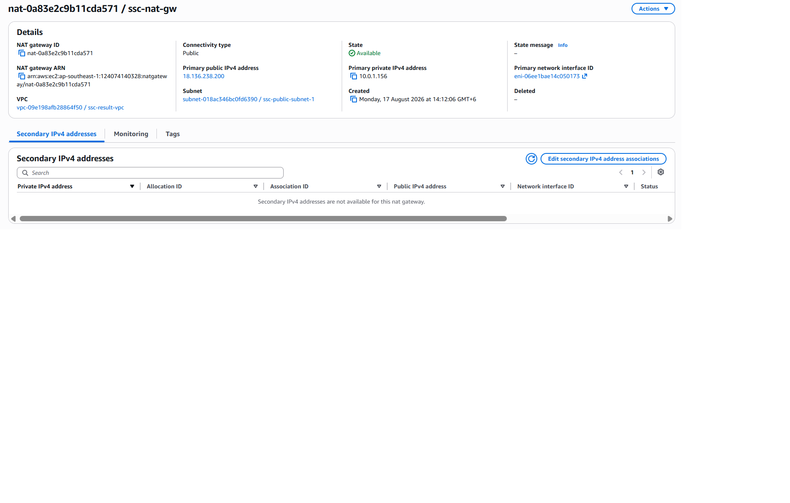
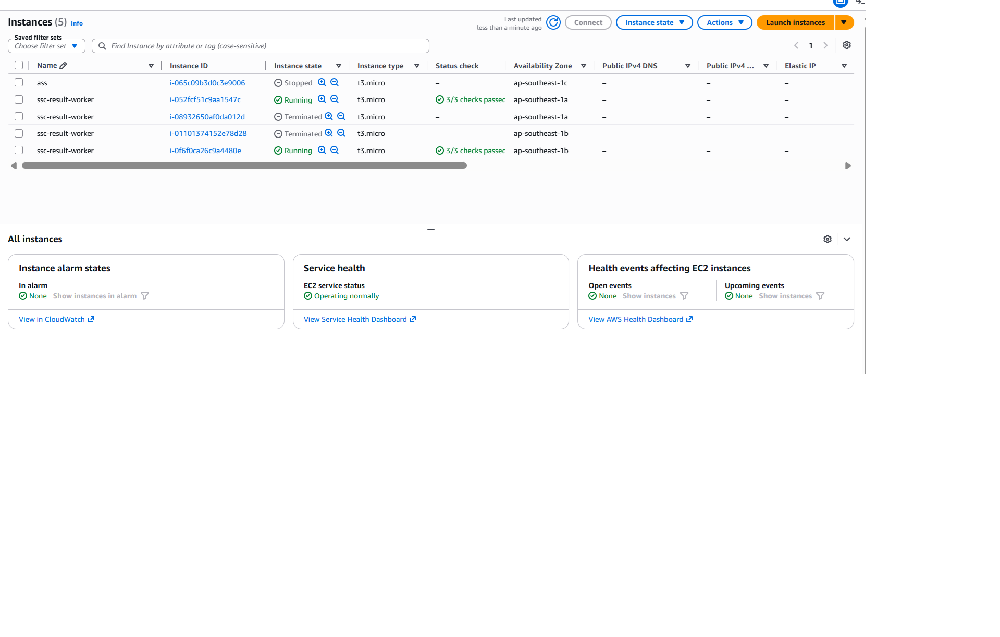
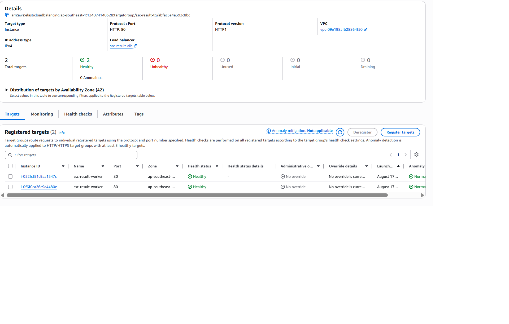
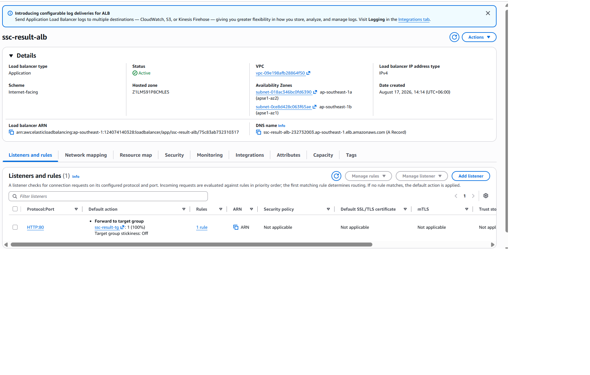
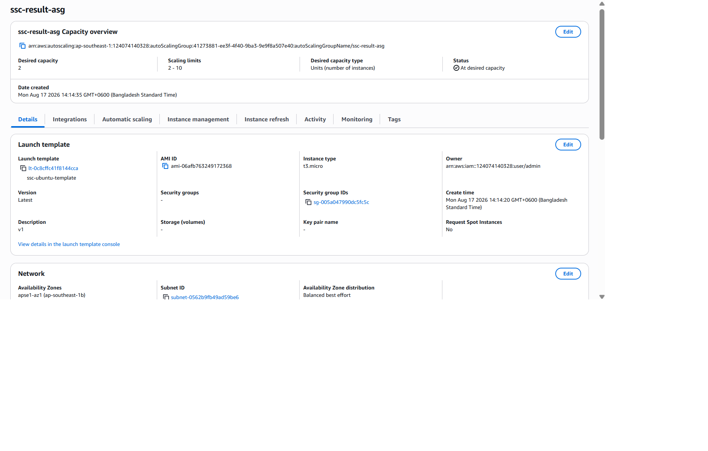
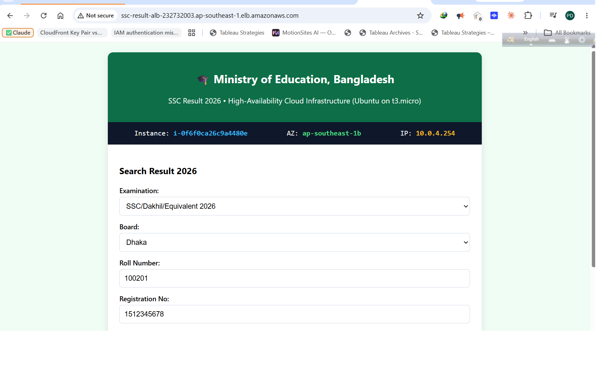

# 📑 AWS Practical Assignment 7: Scalable SSC Result Publishing Infrastructure
**Course:** DevOps & Cloud Engineering | **Module 7 Assignment**  
**Scenario:** Handling 10:00 AM High-Traffic Spike for SSC Result Publishing  
**Platform:** AWS (Ubuntu 22.04 LTS on `t3.micro`)  

---

## 1. 🏛️ Architecture Overview & Diagram

The infrastructure uses a secure Multi-AZ architecture across two Availability Zones (`ap-southeast-1a` and `ap-southeast-1b`):
- **Public Subnets:** Host the Internet-facing Application Load Balancer (ALB) and NAT Gateway.
- **Private Subnets:** Host the Auto Scaling EC2 instances running Nginx with the SSC Result 2026 web application (Zero direct internet ingress).

```mermaid
flowchart TD
    Users([🌐 Internet Candidates]) -->|HTTP Port 80| ALB[Application Load Balancer\nPublic Subnets: 10.0.1.0/24 & 10.0.2.0/24]
    
    subgraph VPC ["Custom AWS VPC: ssc-result-vpc (10.0.0.0/16)"]
        subgraph PublicSubnets ["Public Subnets"]
            ALB
            NATGW[NAT Gateway in Public Subnet 1]
            IGW[Internet Gateway]
        end
        
        subgraph PrivateSubnets ["Private Subnets"]
            ASG[Auto Scaling Group: ssc-result-asg\nMin: 2 | Desired: 2 | Max: 10]
            EC2_1[EC2 Node 1\nPrivate IP: 10.0.3.x\nUbuntu + Nginx]
            EC2_2[EC2 Node 2\nPrivate IP: 10.0.4.x\nUbuntu + Nginx]
            ASG --- EC2_1
            ASG --- EC2_2
        end
    end
    
    ALB -->|Forward Port 80| EC2_1
    ALB -->|Forward Port 80| EC2_2
    EC2_1 -.->|Outbound Packages| NATGW
    EC2_2 -.->|Outbound Packages| NATGW
    NATGW -.-> IGW
    IGW -.-> Internet([🌐 Public Internet])
```

---

## 2. 📝 Short Report (5 Mandatory Sections)

### A. VPC & Network Architecture
A dedicated custom VPC `ssc-result-vpc` (`10.0.0.0/16`) is deployed across two Availability Zones with:
- **2 Public Subnets** (`10.0.1.0/24`, `10.0.2.0/24`) for ALB and NAT Gateway.
- **2 Private Subnets** (`10.0.3.0/24`, `10.0.4.0/24`) for backend EC2 instances.
- **Public Route Table** (`ssc-public-rt`) routes `0.0.0.0/0` to Internet Gateway (`ssc-result-igw`).
- **Private Route Table** (`ssc-private-rt`) routes `0.0.0.0/0` to NAT Gateway (`ssc-nat-gw`).

### B. ALB and EC2 Traffic Flow
1. Candidates send HTTP requests to the ALB DNS name.
2. The ALB Security Group (`ssc-alb-sg`) accepts public traffic on Port 80.
3. The ALB balances and forwards requests to private EC2 instances across both AZs.
4. The EC2 Security Group (`ssc-ec2-private-sg`) strictly allows Port 80 traffic **only from `ssc-alb-sg`**. Direct access from the internet is completely blocked.
5. The ALB Target Group (`ssc-result-tg`) monitors `/health` to route traffic only to healthy nodes.

### C. Purpose of NAT Gateway
The NAT Gateway resides in Public Subnet 1 with an Elastic IP. It allows private EC2 instances to make outbound internet calls to install system packages, security updates, and Nginx during User Data bootstrapping, while preventing any unsolicited inbound connections from reaching private instances.

### D. Auto Scaling Strategy
- **Baseline Capacity:** Minimum: 2, Desired: 2, Maximum: 10 instances across 2 AZs.
- **Proactive Scaling (10:00 AM Spike):** Scheduled scaling pre-warms capacity to 10 instances before 10:00 AM.
- **Dynamic Target Tracking Policy:** Configured for **Average CPU Utilization at 50%**. If traffic exceeds baseline, new `t3.micro` instances launch automatically.
- **Scale-In:** Excess instances terminate automatically after the traffic spike subsides.

### E. Handling the SSC Result Traffic Spike
By combining the Application Load Balancer (for Round-Robin request distribution), Multi-AZ private subnets (for high availability), lightweight Nginx static caching (<30 MB RAM per `t3.micro`), and proactive Auto Scaling, the infrastructure can seamlessly absorb hundreds of thousands of concurrent result queries without downtime.

---

## 3. 📸 AWS Console Verification Screenshots

### 1. VPC Configuration (`ssc-result-vpc`)


### 2. Internet Gateway (`ssc-result-igw`)


### 3. NAT Gateway (`ssc-nat-gw`)


### 4. Route Tables (Public & Private)


### 5. Launch Template (`ssc-ubuntu-template` on `t3.micro`)


### 6. EC2 Instances (Private Subnets)


### 7. Target Group & Health Check Status


### 8. Application Load Balancer (`ssc-result-alb`)


### 9. Auto Scaling Group (`ssc-result-asg`)


### 10. Live SSC Result 2026 Web Page (through ALB DNS)

